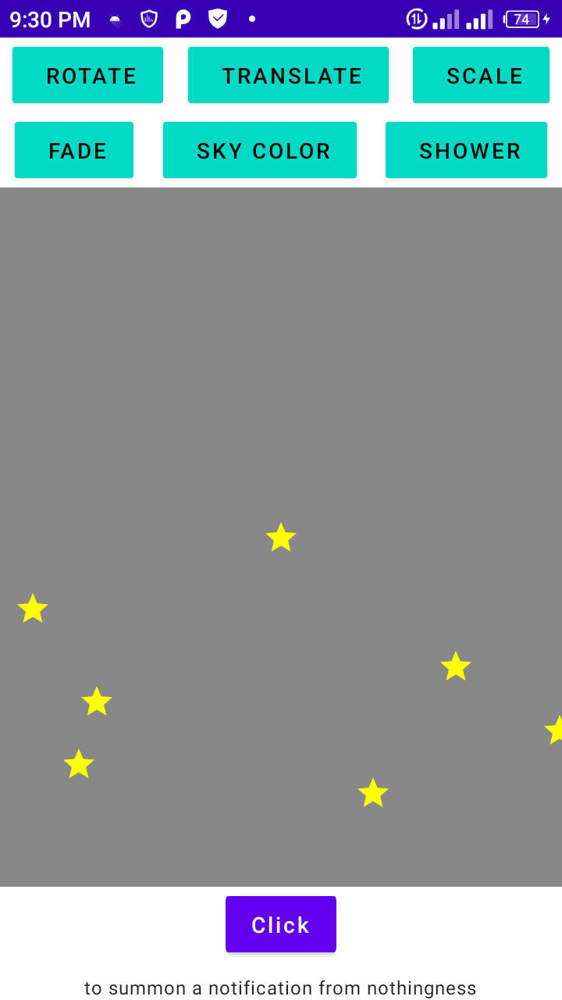

# KodeCamp Internship Tasks

A repo housing simple tasks given by mentors during KodeCamp Internship

## Task I & III - Customized Notification
A simple app showing a button that when clicked brings up a notification and a bunch of buttons that
when clicked plays animations

### Screenshots

## Task II - MyCanva
A simple drawing app
### Screenshots

## Task IV - Short Story

A simple app showing animations with motion layout

### Screenshots

## Task V - Maps

A simple app showing the different types of maps

### Screenshots

## Task VI - Geofence

A simple app implementing geofencing in android
